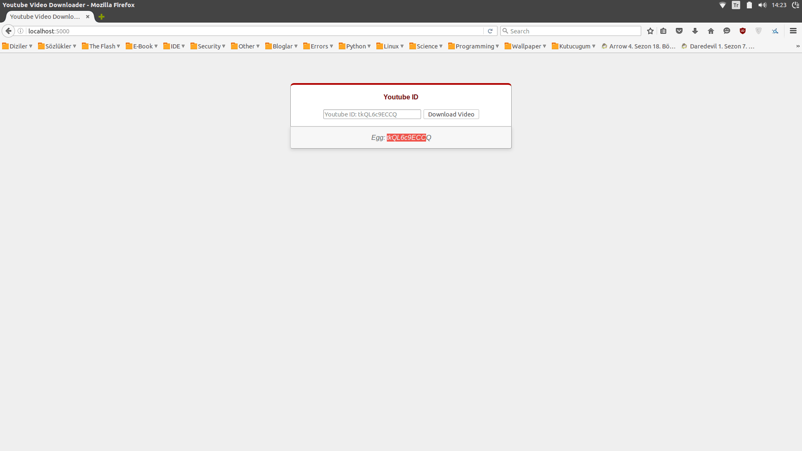

#Youtube Video Downlader

Video downlading with Flask and Pafy

Tasarımı çok fazla kasmadım. Çok ahım şahım anladığım şey değil sonuçta. Değiştirebilirsiniz İşini yapıyor o önemli :)

Aşağıda gereksinimler yazıyor. Pafy ile hallettim olayı ancak pafy de youtube-dl kütüphanesini istiyor.. En alttaki GIF ile nasıl çalıştığını göstermeye çalıştım

### Requirements

    - Flask
    - Pafy
    - Youtube-Dl

### Test

